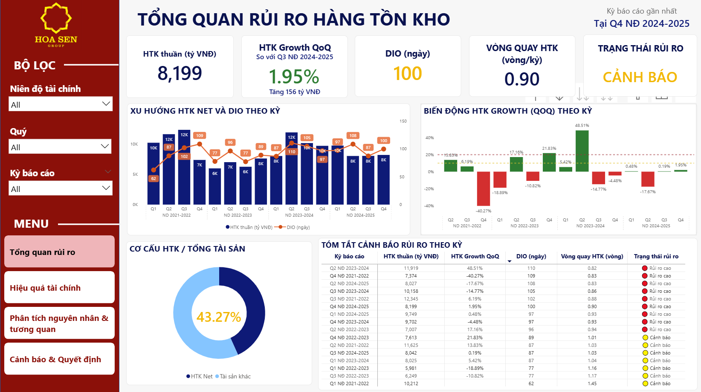
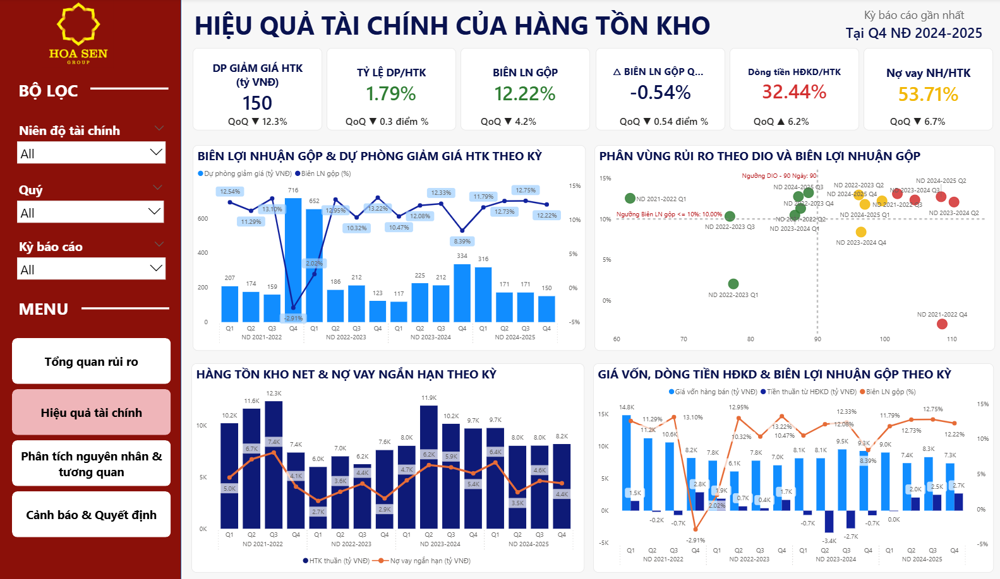
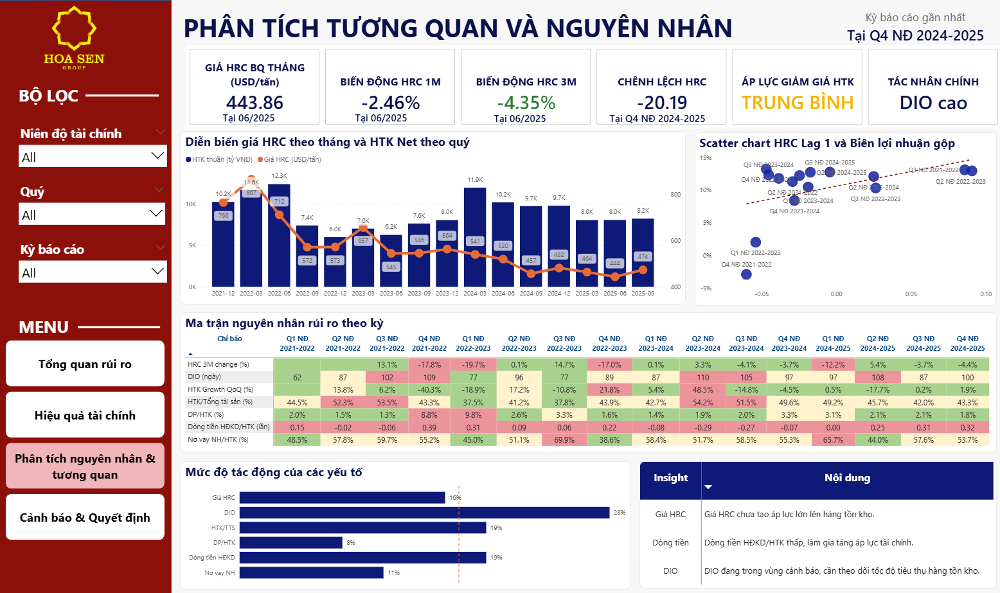
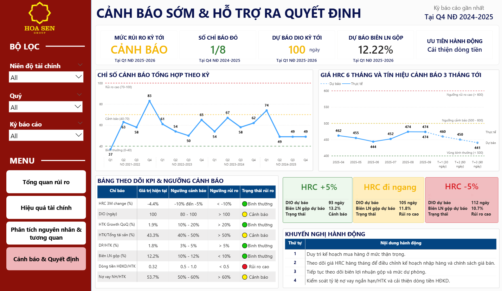

Dự án xây dựng **Dashboard trên Power BI** nhằm hỗ trợ theo dõi và nhận diện sớm rủi ro hàng tồn kho tại **Công ty Cổ phần Tập đoàn Hoa Sen (HSG)**.
## 1. Tổng quan dự án

Dự án này xây dựng Dashboard trên Power BI nhằm hỗ trợ theo dõi và nhận diện sớm rủi ro hàng tồn kho tại Công ty Cổ phần Tập đoàn Hoa Sen (HSG).

Dashboard được thiết kế để chuyển hóa dữ liệu báo cáo tài chính và dữ liệu thị trường giá thép HRC thành các chỉ số trực quan, giúp người dùng theo dõi quy mô hàng tồn kho, tốc độ luân chuyển, áp lực tài chính, biến động giá HRC và các kịch bản rủi ro có thể xảy ra.

Trong phạm vi dự án, Dashboard không phải là hệ thống cảnh báo tự động theo thời gian thực, mà là công cụ trực quan hóa dữ liệu và hỗ trợ ra quyết định, trong đó các chỉ số được so sánh với ngưỡng xanh – vàng – đỏ để nhận diện trạng thái rủi ro.

## 2. Bối cảnh thực hiện

Ngành thép là ngành có tính chu kỳ cao, chịu ảnh hưởng mạnh từ biến động giá nguyên vật liệu, nhu cầu tiêu thụ và áp lực vốn lưu động. Với doanh nghiệp thép, hàng tồn kho không chỉ là khoản mục tài sản lớn mà còn ảnh hưởng trực tiếp đến giá vốn, biên lợi nhuận, dòng tiền và nhu cầu tài trợ ngắn hạn.

Đối với Hoa Sen Group, giá thép cuộn cán nóng HRC là một biến số quan trọng vì có thể tác động đến rủi ro giảm giá hàng tồn kho và hiệu quả tài chính. Do đó, việc kết hợp dữ liệu tài chính với dữ liệu giá HRC giúp Dashboard hỗ trợ nhận diện rủi ro sớm hơn so với việc chỉ theo dõi báo cáo tài chính truyền thống.

## 3. Mục tiêu dự án

Dự án hướng đến các mục tiêu chính:

Xây dựng bộ chỉ số KPI/KRI phản ánh rủi ro hàng tồn kho.
Tích hợp dữ liệu báo cáo tài chính và dữ liệu giá HRC vào Power BI.
Trực quan hóa trạng thái rủi ro hàng tồn kho theo từng kỳ.
Thiết lập ngưỡng cảnh báo xanh – vàng – đỏ cho các chỉ tiêu trọng yếu.
Phân tích nguyên nhân rủi ro và hỗ trợ nhà quản trị đưa ra hành động phù hợp.
## 4. Cấu trúc Dashboard

Dashboard gồm 4 trang chính:

Trang 1: Tổng quan rủi ro hàng tồn kho

Theo dõi quy mô hàng tồn kho, tốc độ tăng trưởng hàng tồn kho, DIO, vòng quay hàng tồn kho và trạng thái rủi ro tổng thể.

Trang 2: Hiệu quả tài chính của hàng tồn kho

Phân tích tác động của hàng tồn kho đến biên lợi nhuận gộp, dự phòng giảm giá hàng tồn kho, dòng tiền hoạt động kinh doanh và nợ vay ngắn hạn.

Trang 3: Phân tích nguyên nhân và tương quan

Kết hợp dữ liệu nội tại doanh nghiệp với biến động giá HRC để nhận diện các yếu tố dẫn dắt rủi ro như DIO cao, HRC giảm, dòng tiền yếu hoặc tỷ trọng tồn kho lớn.

Trang 4: Cảnh báo sớm và hỗ trợ ra quyết định

Tổng hợp các tín hiệu rủi ro, số chỉ báo đỏ, mức rủi ro kỳ tới, phân tích kịch bản giá HRC và đề xuất hành động quản trị.

## 5. Các chỉ số chính

Dashboard sử dụng các nhóm chỉ số sau:

Nhóm quy mô hàng tồn kho
Hàng tồn kho thuần
Hàng tồn kho gộp
Tỷ lệ hàng tồn kho trên tổng tài sản
Nhóm hiệu quả luân chuyển
Vòng quay hàng tồn kho
DIO – số ngày tồn kho bình quân
Tăng trưởng hàng tồn kho theo quý
Nhóm hiệu quả tài chính
Biên lợi nhuận gộp
Dự phòng giảm giá hàng tồn kho
Tỷ lệ dự phòng trên hàng tồn kho
Nhóm dòng tiền và tài trợ vốn
Dòng tiền hoạt động kinh doanh trên hàng tồn kho
Nợ vay ngắn hạn trên hàng tồn kho
Nhóm tín hiệu thị trường
Giá HRC bình quân
Biến động giá HRC 1 tháng
Biến động giá HRC 3 tháng
HRC lag để xem xét tác động có độ trễ đến biên lợi nhuận
## 6. Phương pháp thực hiện

Quy trình xây dựng Dashboard gồm các bước:

Thu thập dữ liệu báo cáo tài chính của HSG và dữ liệu giá HRC.
Làm sạch, chuẩn hóa và xử lý dữ liệu bằng Power Query.
Xây dựng mô hình dữ liệu trong Power BI.
Tạo các measure DAX để tính toán KPI/KRI.
Thiết lập ngưỡng cảnh báo xanh – vàng – đỏ.
Thiết kế các trang Dashboard theo logic từ tổng quan đến chi tiết.
Xây dựng phân tích kịch bản HRC và khuyến nghị hành động.
## 7. Công cụ sử dụng
Microsoft Power BI
Power Query
DAX
Dữ liệu báo cáo tài chính công bố
Dữ liệu giá thép HRC từ nguồn thị trường
## 8. Giá trị của dự án

Dashboard giúp chuyển các dữ liệu tài chính và thị trường rời rạc thành hệ thống thông tin trực quan, hỗ trợ người dùng:

Nhận diện nhanh kỳ có dấu hiệu rủi ro hàng tồn kho.
Theo dõi các chỉ tiêu vượt ngưỡng cảnh báo.
Phân tích nguyên nhân rủi ro theo từng nhóm chỉ số.
Đánh giá tác động của biến động giá HRC.
Đưa ra định hướng hành động như kiểm soát mua hàng, cải thiện dòng tiền, rà soát dự phòng và quản lý nợ vay.

Dự án góp phần chuyển cách theo dõi hàng tồn kho từ hậu kiểm dựa trên báo cáo tài chính sang giám sát chủ động hơn dựa trên KPI/KRI và tín hiệu thị trường.

## 9. Hạn chế

Dự án chủ yếu sử dụng dữ liệu công khai từ báo cáo tài chính và dữ liệu giá HRC bên ngoài, do đó chưa phản ánh đầy đủ dữ liệu vận hành nội bộ của doanh nghiệp.

Một số hạn chế chính:

Chưa có dữ liệu tồn kho theo mã hàng.
Chưa có dữ liệu tuổi hàng tồn kho.
Chưa có dữ liệu chi tiết theo kho, khu vực hoặc nhóm sản phẩm.
Chưa tích hợp dữ liệu đơn hàng, công nợ và kế hoạch mua nguyên vật liệu.
Ngưỡng cảnh báo và kịch bản HRC mang tính mô phỏng phục vụ nghiên cứu, chưa phải chuẩn vận hành nội bộ chính thức.
## 10. Hướng phát triển

Trong tương lai, Dashboard có thể được mở rộng theo các hướng:

Tích hợp dữ liệu ERP/WMS.
Theo dõi tồn kho theo mã hàng, nhóm sản phẩm và kho.
Phân tích tuổi hàng tồn kho.
Cập nhật dữ liệu gần thời gian thực.
Bổ sung cảnh báo tự động qua Power BI Service, email hoặc hệ thống nội bộ.
Tích hợp mô hình dự báo DIO, giá HRC và rủi ro hàng tồn kho.
Mở rộng phân tích theo khách hàng, thị trường tiêu thụ và khu vực bán hàng.

## 11. Từ khóa

`Power BI` `Dashboard` `Inventory Risk` `Early Warning` `Hoa Sen Group` `HSG` `HRC Price` `KPI` `KRI` `DAX` `Power Query` `Business Intelligence`
## 👩‍💻 Tác giả

**Nguyễn Thị Huyền Dịu**  
Ngành: Phân tích dữ liệu kinh doanh  
Đề tài: *Ứng dụng Dashboard hỗ trợ cảnh báo sớm rủi ro hàng tồn kho tại Công ty Cổ phần Tập đoàn Hoa Sen* 
🔗 **Link Dashboard Power BI:** [Xem Dashboard tại đây] https://drive.google.com/file/d/1BqtYj-cX1qYikegJDVMpmUnM_TLz9yiZ/view?usp=drive_link

